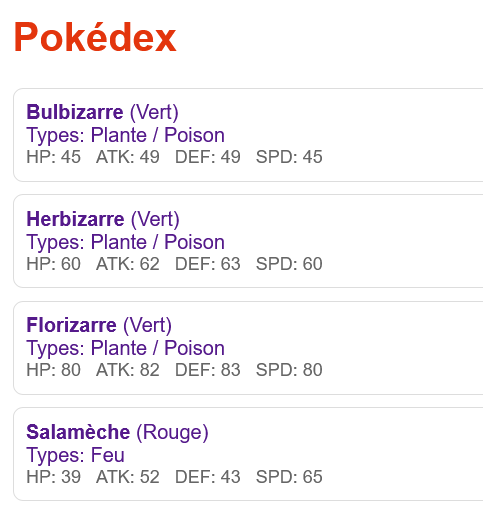
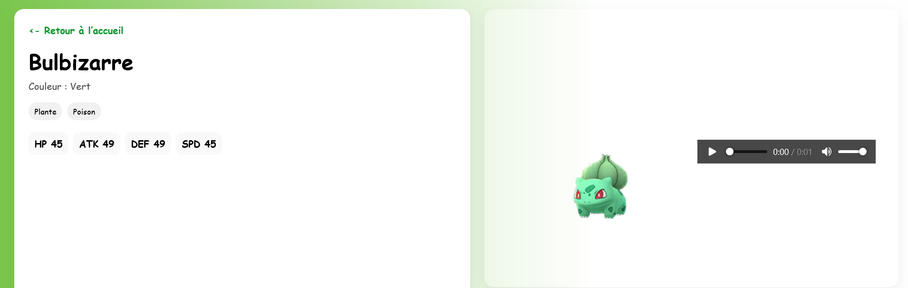

# pokedex_api_springboot
### API Pokedex avec Springboot PostgreSQL & Front statique

Un petit projet perso pour m’entraîner au développement back-end avec Spring Boot (Java 17), JPA/Hibernate et PostgreSQL, sur un thème simple et fun : ***Les Pokémon*** .

Le front est volontairement minimaliste (**HTML/CSS/JS** dans **static/**) pour se concentrer sur l’API et 
les bonnes pratiques 
(structuration, validations, erreurs, doc Swagger, etc.).

# Objectifs pédagogiques

- Concevoir une API REST propre : CRUD, recherche, gestion d’erreurs.

- Manipuler JPA/Hibernate avec PostgreSQL (entités, repository).

- Tester l’API (pokemonController ) avec Swagger UI.

- Faire un front statique pour l’API (liste de tout les Pokemon + page individuel détaillé).

- Intégrer des données externes (sprites et cris via PokeAPI)

Image du Pokedex :

Page d'un Pokemon :

