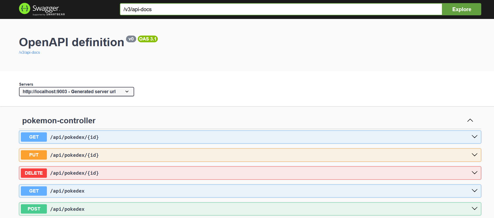

## Swagger UI :

Lien : http://localhost:9003/swagger-ui/index.html

# Les Endpoints

- **GET**	/api/pokedex	Liste tous les Pokémon 

- **POST**	/api/pokedex	: Crée un Pokémon

- **GET**	/api/pokedex/{id}	: Récupère un Pokémon par son id- 

- **PUT**	/api/pokedex/{id}	: Met à jour un Pokémon- 

- **DELETE**	/api/pokedex/{id}	: Supprime un Pokémon

- **GET**	/api/pokedex/search?type=...**	:  Recherche par type1 (insensible casse)

- **GET**	/api/pokedex/{id}/cry	: Renvoie le cri du pokemon en format .ogg